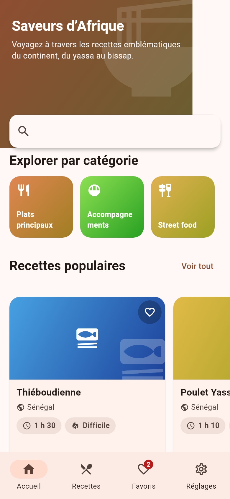
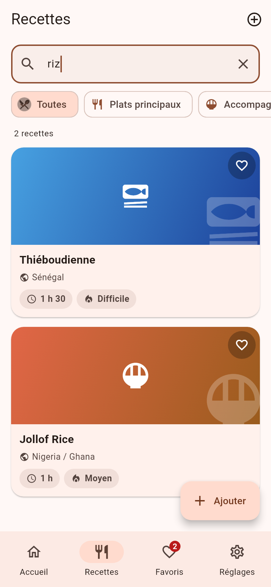
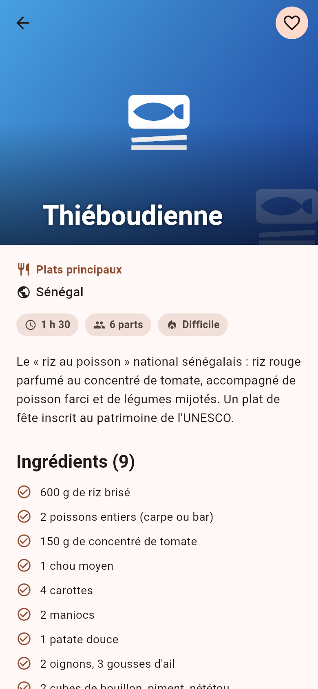
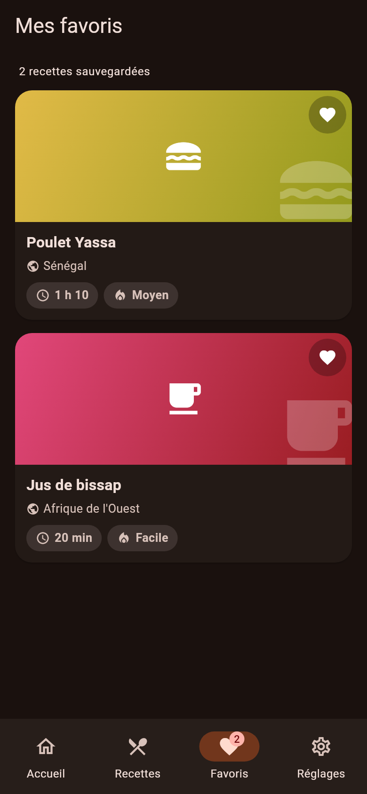
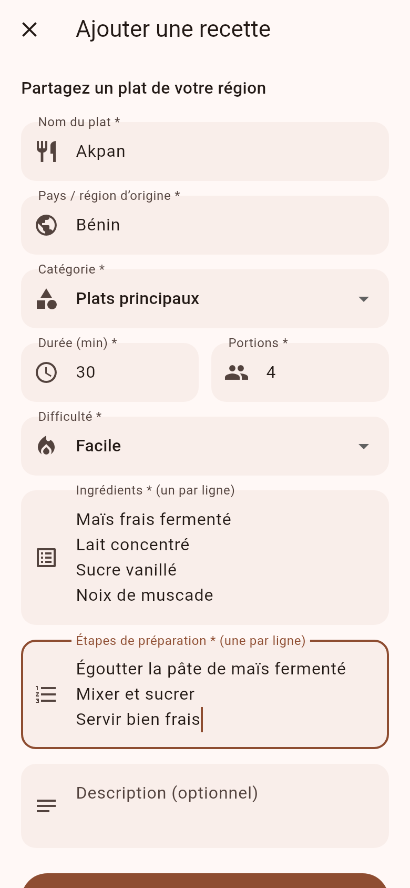
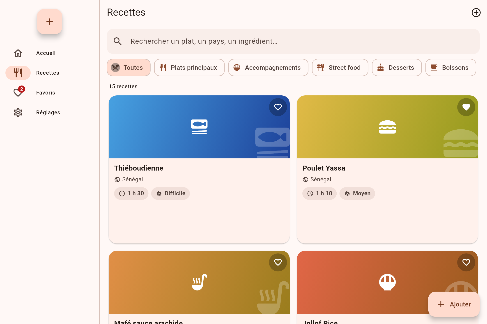
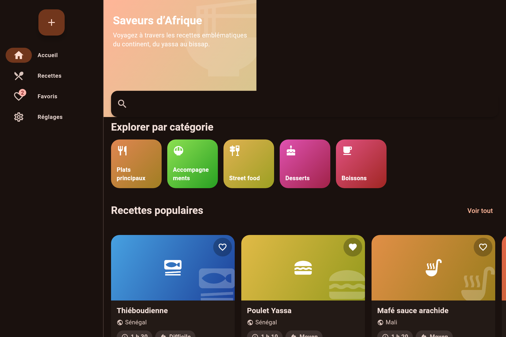

# 🍲 Saveurs d'Afrique — Application Flutter

Application mobile multi-écrans qui fait voyager à travers les recettes
emblématiques du continent africain : **thiéboudienne, poulet yassa, mafé,
jollof rice, injera, ndolè, bobotie, aloco, puff-puff, bissap, gnamakoudji…**

Projet réalisé pour valider la maîtrise des widgets Flutter et de la
navigation : **GoRouter (Navigator 2.0)**, Material 3, interface **responsive
mobile / tablette**, thèmes clair et sombre, et séparation stricte entre
l'interface et les données.

---

## 📸 Captures d'écran

### Mobile

| Accueil | Recherche & filtrage | Détail d'une recette |
|:---:|:---:|:---:|
|  |  |  |
| Favoris (thème sombre) | Formulaire d'ajout | |
|  |  | |

### Tablette (navigation en rail latéral)

| Recettes en grille (clair) | Accueil (sombre) |
|:---:|:---:|
|  |  |

> Toutes les captures sont générées automatiquement par des **tests goldens**
> (voir `test/screenshots_golden_test.dart`), à 390×844 (mobile) et
> 1080×720 (tablette).

---

## ✨ Fonctionnalités

### Fonctionnalités obligatoires

- [x] **6 écrans distincts** (4 minimum demandés)
  1. **Accueil** — en-tête immersif, catégories, carrousel de recettes populaires
  2. **Recettes** — liste avec **recherche textuelle** et **filtrage par catégorie**
  3. **Détail d'une recette** — reçu via le paramètre de route `/recette/:id`
  4. **Ajout de recette** — **formulaire validé** (7 champs)
  5. **Favoris** — écran bonus des recettes sauvegardées
  6. **Réglages** — bascule du thème **système / clair / sombre**
- [x] **Navigation GoRouter** (Navigation 2.0) avec **routes nommées** et
      `StatefulShellRoute` (onglets persistants, barre en bas sur mobile,
      rail latéral sur tablette)
- [x] **Écran de liste avec recherche / filtrage**
  (recherche sur nom, pays, description *et* ingrédients + `FilterChip` de catégories)
- [x] **Écran de détail avec passage de paramètres**
  (`/recette/:id`, le tag Hero est également transmis via `extra`)
- [x] **Formulaire avec validation** : nom, pays, catégorie, durée, nombre de
      portions, difficulté, ingrédients (≥ 2, un par ligne), étapes (≥ 1),
      description optionnelle
- [x] **Gestion du thème clair / sombre** (+ mode système)

### Exigences techniques

- [x] **Plus de 25 widgets différents** utilisés : `Scaffold`, `AppBar`,
      `CustomScrollView`, `SliverAppBar`, `SliverList`, `ListView`,
      `GridView`, `Card`, `Stack`, `Positioned`, `Column`, `Row`, `Wrap`,
      `Container`, `Padding`, `Center`, `Expanded`, `Hero`, `Chip` /
      `FilterChip`, `NavigationBar`, `NavigationRail`, `Badge`, `ListTile`,
      `RadioGroup` / `RadioListTile`, `TextField` / `TextFormField`,
      `DropdownButtonFormField`, `FloatingActionButton`, `FilledButton`,
      `TextButton`, `IconButton`, `CircleAvatar`, `Divider`, `SnackBar`,
      `Tooltip`, `LayoutBuilder`, `FlexibleSpaceBar`, `InkWell`,
      `LinearProgressIndicator` / `CircularProgressIndicator`…
- [x] **8 widgets réutilisables** dans le dossier `lib/widgets/`
      (3 minimum demandés)
- [x] **Responsive mobile et tablette** :
      `NavigationBar` ↔ `NavigationRail`, `ListView` ↔ `GridView`,
      contraintes de largeur maximale sur les écrans de détail / formulaire
- [x] **Aucune donnée en dur dans les widgets** : les recettes vivent dans
      `lib/data/` et sont exposées via un *repository* et un *store*
      (`ChangeNotifier`) ; les widgets ne reçoivent que des modèles
- [x] **16 tests** automatisés (tests unitaires, tests de widgets, goldens)
- [x] **Animations Hero** entre les vignettes et l'écran de détail

---

## 🏗️ Architecture

```
lib/
├── main.dart                    # Point d'entrée
├── app.dart                     # MaterialApp.router + injection de l'état
├── models/
│   └── recipe.dart              # Modèle Recipe (immuable) + enum Difficulty
├── data/
│   ├── categories.dart          #   Métadonnées des catégories
│   ├── seed_recipes.dart        #   Jeu de données de départ (15 recettes)
│   └── recipe_repository.dart   #   Contrat d'accès aux données (repository)
├── state/
│   └── app_state.dart           # RecipeStore + ThemeController (ChangeNotifier)
├── router/
│   └── app_router.dart          # GoRouter : routes nommées + StatefulShellRoute
├── theme/
│   └── app_theme.dart           # Thèmes Material 3 clair et sombre
├── widgets/                     # Widgets réutilisables (aucune donnée en dur)
│   ├── app_shell.dart           #   Coquille responsive (NavigationBar/Rail)
│   ├── recipe_card.dart         #   Carte de recette + Hero + favori
│   ├── gradient_thumbnail.dart  #   Vignette dégradée générée
│   ├── info_pill.dart           #   Pastille d'info (durée, difficulté…)
│   ├── section_title.dart       #   Titre de section
│   ├── empty_state.dart         #   État vide
│   ├── category_filter_chips.dart
│   └── responsive_recipe_view.dart  # ListView mobile / GridView tablette
└── screens/
    ├── home_screen.dart
    ├── recipes_screen.dart
    ├── recipe_detail_screen.dart
    ├── add_recipe_screen.dart
    ├── favorites_screen.dart
    └── settings_screen.dart
```

**Flux de données :** `seed_recipes.dart` → `InMemoryRecipeRepository` →
`RecipeStore` (ChangeNotifier, exposé via `InheritedNotifier`) → widgets.
Les recettes créées via le formulaire sont ajoutées au store et apparaissent
immédiatement dans la liste, les favoris et la section « Mes créations ».

### Routes nommées

| Nom        | Chemin           | Écran                          |
|------------|------------------|--------------------------------|
| `accueil`  | `/accueil`       | Accueil                        |
| `recettes` | `/recettes`      | Liste + recherche (`?category=` accepté) |
| `favoris`  | `/favoris`       | Favoris                        |
| `reglages` | `/reglages`      | Réglages (thème)               |
| `recette`  | `/recette/:id`   | Détail (paramètre `id`, `extra` = tag Hero) |
| `ajouter`  | `/ajouter`       | Formulaire en plein écran      |

---

## 🚀 Instructions de lancement

### Prérequis

- [Flutter SDK](https://docs.flutter.dev/get-started/install) **3.13+**
  (`flutter --version` doit fonctionner)
- Un simulateur/émulateur, un appareil connecté, ou Chrome pour le web

```bash
flutter doctor
```

### Installation

```bash
git clone https://github.com/<VOTRE-PSEUDO>/saveurs-afrique.git
cd saveurs-afrique
flutter pub get
```

### Lancer l'application

```bash
# Sur un appareil / émulateur connecté
flutter run

# Ou spécifiquement dans Chrome (web)
flutter run -d chrome

# Mode sombre immédiat (facultatif) : basculer depuis l'onglet « Réglages »
```

### Builds de production

```bash
# Web (génère build/web)
flutter build web --release

# APK Android
flutter build apk --release
```

### Tests

```bash
# Tous les tests (unitaires + widgets + goldens)
flutter test

# Vérification statique
flutter analyze

# Régénérer les captures d'écran (goldens) après une modification d'UI
flutter test test/screenshots_golden_test.dart --update-goldens
```

> Remarque : les goldens sont comparés pixel pour pixel. Sur une autre
> plateforme que Linux, utilisez `flutter test --update-goldens` pour les
> rafraîchir.

---

## 🧭 Responsive

| Largeur d'écran          | Navigation          | Liste des recettes        |
|--------------------------|---------------------|---------------------------|
| `< 700 px` (mobile)      | `NavigationBar` bas | `ListView` vertical       |
| `700–920 px` (tablette)  | `NavigationRail`    | `GridView` 2 colonnes     |
| `> 920 px` (grand écran) | `NavigationRail` étendue | `GridView` 3 colonnes |

Les écrans de détail et de formulaire sont centrés avec une largeur maximale
pour rester lisibles sur tablette.

---

## 🛠️ Stack

- **Flutter 3.47 / Dart 3.13**
- [go_router](https://pub.dev/packages/go_router) — Navigation déclarative 2.0
- Material 3 (`ColorScheme.fromSeed`, `Card`, `NavigationBar`, `NavigationRail`)
- `ChangeNotifier` + `InheritedNotifier` pour la gestion d'état légère
  (aucune autre dépendance que le SDK et GoRouter)

---

## 📄 Licence

Projet pédagogique — libre d'utilisation et de modification (MIT).
